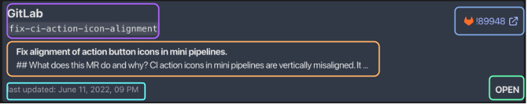

# MergeRequest

plan to do [interactive code editor](https://docusaurus.io/docs/markdown-features/code-blocks#interactive-code-editor) here

REPO NAME &amp; BRANCH
 
MR TITTLE &amp; DESCRIPTION
 
LINK
 
TIMESTAMP
 
MR STATUS
